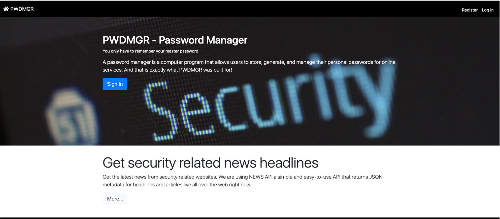
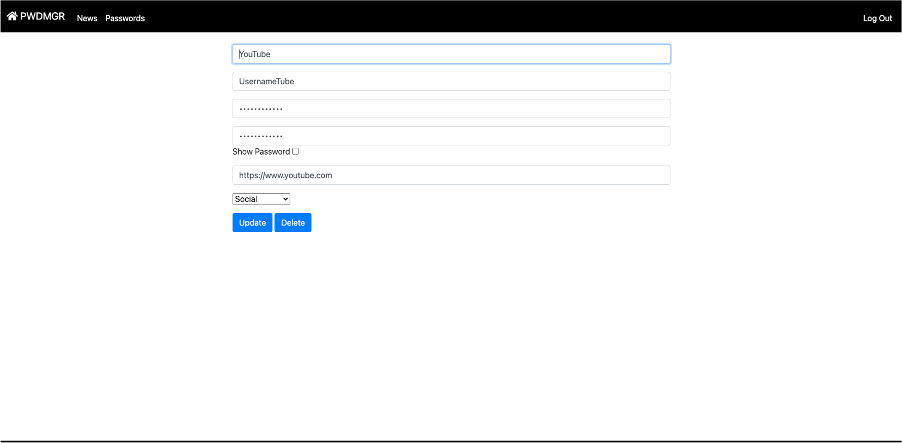
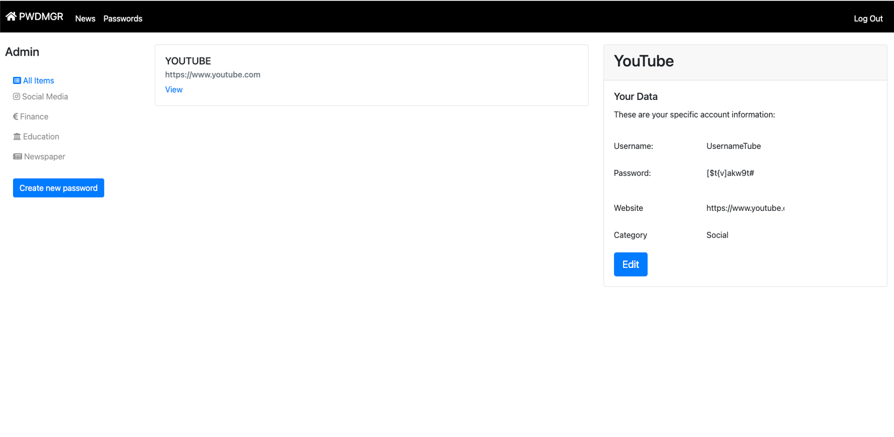

# PWDMGR
PWDMGR is a password manager web-application written in Python with Flask, HTML, CSS, JavaScript and SQL.

# The Web-App has the following features:
* Create Account (Register)
* Log-In and Log-Out
* Create new items (your accounts that you want to manage)
* Edit your items
* Delete your items
* Read security related breaing news through NEWS API
* Password validation
* hash masterpassword
* every username is unique
* integrated password generator

# Requirements and used python libraries
* CS50 library
* flask
* flask_session
* newsapi
* requests
* tempfile
* werkzeug
* functools
* os
* json
* string
* random
* config
* datetime

